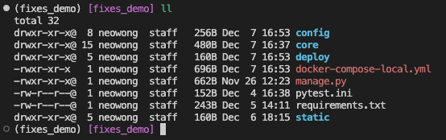

# README

This is a simple demo of Django and DRF frame.

## 1. Deploy

1. First, go into fixes_demo folder.



1. If this is the first time deploy this server, You need to uncomment the `env_file` setting in `docker-compose-local.yml` file.


1. Before you run the docker-compose command, if you want to use your own python index url, you can replace script 2 with script 1, and replace the url after `-i` . 


1. Run the docker-compose command in fixes_demo folder:

```bash
docker-compose --verbose -f docker-compose-local.yml up
```


1. If you can see this, the server is up and running.


1. Type the address `[localhost:8000](http://localhost:8000)` in your browser, then you can get this.


## API Test

Product API:

1. Create product: use the `POST` method to send a request to `[localhost:8000/products/](http://localhost:8000/products/)` 


1. Get all product: use the `GET` method to send a request to `[localhost:8000/products/](http://localhost:8000/products/)` 


Variant API:

1. Create variant: use the `POST` method to send a request to `[localhost:8000/variants/](http://localhost:8000/products/)` 


1. Get all variant: use the `GET` method to send a request to `[localhost:8000/variants/](http://localhost:8000/products/)` 


Image API:

1. Create image: use the `POST` method to send a request to `[localhost:8000/images/](http://localhost:8000/products/)` 


1. Get all image: use the `GET` method to send a request to `[localhost:8000/images/](http://localhost:8000/products/)` 


1. Get image by using id: use the `GET` method to send a request to `[localhost:8000/images/<id>/](http://localhost:8000/products/)` 


1. Update image: use the `PUT` method to send a request to `[localhost:8000/images/<id>/](http://localhost:8000/products/)` 


This action will also update Product info and Variant info, to link Products/Variants to Image.


Filter and Sorting:

1. Filter:

Can use filter like this format: 

1. `localhost:8000/url/?<field>=<filter_value>`
2. `localhost:8000/url/?<field>__<key_word>=<filter_value>`

Char field can use the following key word:

```bash
'iexact',
'startswith',
'istartswith',
'endswith',
'iendswith',
'contains',
'icontains',
```

Date time field can the following key word:

```bash
'year',
'year__gt',
'year__lt',
'month',
'month__gt',
'month__lt',
'day',
'day__gt',
'day__lt',
```


1. Sorting:

Can use filter like this format: 

1. Ascending: `localhost:8000/url/?sorting=<sorting_field>`


1. Descending: `localhost:8000/url/?sorting=-<sorting_field>`


1. Can use both filtering and sorting by using `&`.


## Addition:

This server can also supply get the API documentation in `localhost:8000/swagger/`


OR [`localhost:8000/redoc/`](http://localhost:8000/redoc/)

